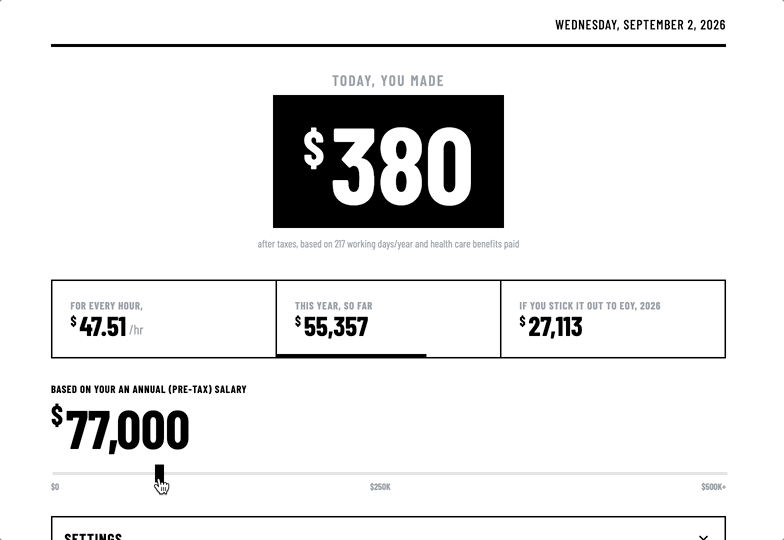
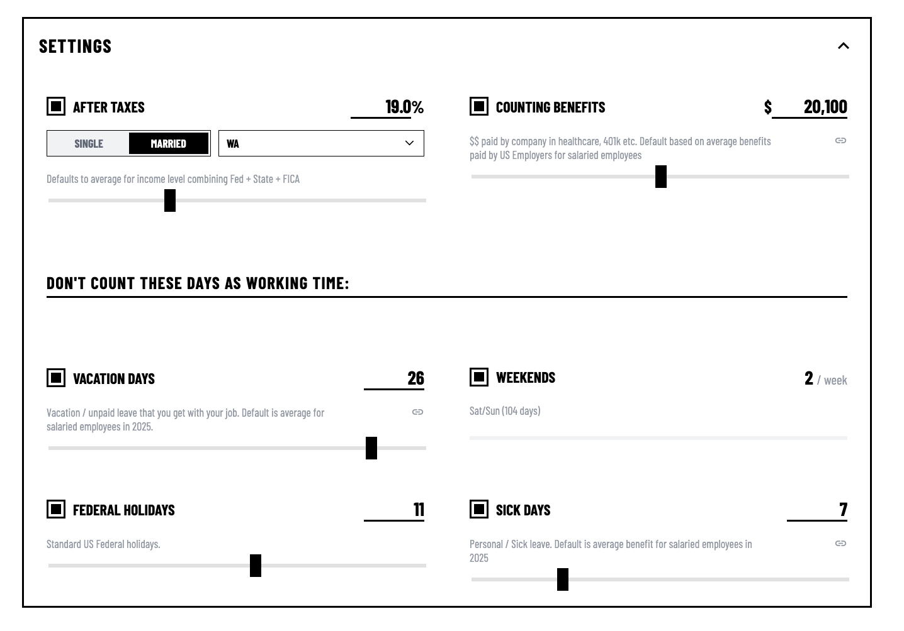

# `made`

Modern salaries are surprisingly difficult to see what a company is paying you for a day of work after taxes. Add your pre-tax salary, see the effective dollar amount of how much you made today (discounting taxes and including befits paid). 

  
[<kbd>   haaans.com/made       </kbd>](https://haaans.com/made)

## Settings

<table>
<tr valign="top">
<td width="50%">
<h3>Grounded data & local storage </h3>

Quick defaults & input data based on us median income and benefits paid. Stores latest state in clearable local cache

</td>
<td width="50%">

</td>
</tr>
</table>

*made by [hans](https://haaans.com/about)*
